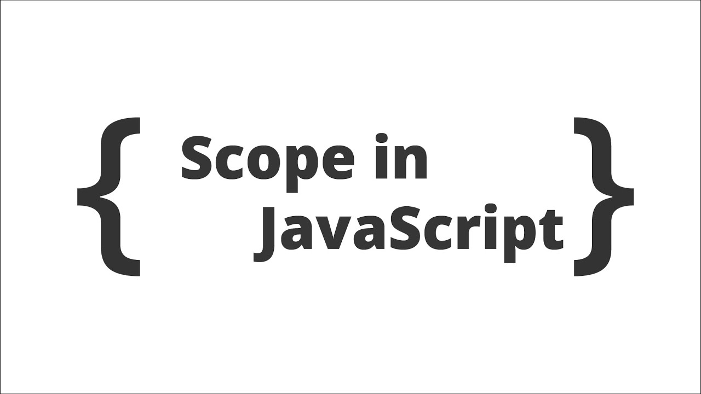
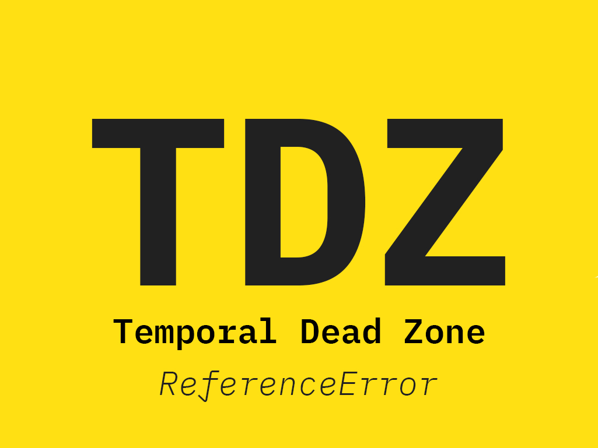

# Three important topics
### 1) Scope
### 2) Hoisting
### 3) TDZ
.jpg)
# What is Scope in JavaScript ?
+ > In JavaScript, scope refers to the current context of your code. This context
determines where you can access certain variables and functions
- > In other
words, where you decide to define a variable or function in JavaScript
impacts where you have access to it later on .
# 4 type of Scope
- 1.Global
+ 2.Function
* 3.Block
* 4.Module

# The role of Global Scope
 >Global Scope : Global scope is the widest
scope available. Variables declared in global
scope are accessible from anywhere in your
code, whether it's inside functions,
conditional statements, loops, or other
blocks of code.
 >Variables declared in global scope are
accessible everywhere

# Function Scope
 >Function Scope : The scope
created with a function. Also
called local Scope
 >Variables accessible only inside
function, NOT outside
 # Block Scope
 >Block scope : Block scope in JavaScript is
like a series of nested boxes within a larger
container, each with its own set of
variables. Block scope is created within
specific code blocks, such as conditional
statements (if, else, switch) and loops (for,
while). 
 >Functions are also block
scoped (only in strict mode)
 >Variables accessible only
inside block (block scope)
HOWEVER, this only
applies to let and const
variables

# What is Hoisting & Temporal Dead Zone in Java Script ?
 >Hoisting is a JavaScript mechanism where variables and function declarations are
moved to the top of their scope before code execution.
Hoisting in JavaScript is a behavior in which a function or a variable
can be used before declaration.
 >The Temporal Dead Zone (TDZ) in JavaScript refers to the period between when a
variable is declared using let or const and when it is initialized. During this time, if
you try to access the variable, it will throw a ReferenceError.

# Variables - Hoisting
 >There’s a temptation to think that all of the
code you see in a
JavaScript program is interpreted line-byline, top-down in order, as the program
execute. While that is essentially true,
there’s one part of that as‐ assumption that
can lead to incorrect thinking about your
program.
 
# Function (declaration) - Hoisting
 >In JavaScript, function declarations are
fully hoisted. This means that both the
function's name and its definition are
moved to the top of their scope, making
the function available to be called
anywhere in that scope, even before its
actual declaration in the code.

.jpg)

# Temporal dead zone let and const
>TDZ : Is the term to describe the state
where variables are un-reachable. They are
in scope, but they aren't declared.
The let and const variables exist in the TDZ
from the start of their enclosing scope
until they are declared.
# How to avoid TDZ ?
>Relatively simply, always make sure you
define your lets and consts at the top of
your scope

